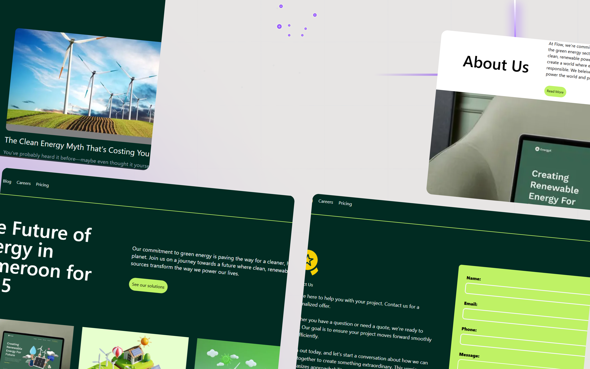

# Flow Energy Solutions - Modern Business Platform

[](https://flow-nu-drab.vercel.app)
[](https://github.com/KMV531/flow)

⚡ **A high-performance corporate website** showcasing innovative energy solutions. Built for scalability, conversion, and seamless content management.



## ✨ Enterprise-Grade Features

- **Sanity CMS Integration**: Effortless content updates by non-technical teams
- **Micro-Interactions**: Subtle animations for enhanced engagement
- **Type-Safe Architecture**: Built with TypeScript for reliability
- **Dynamic Content**: Easily updatable solutions and case studies
- **98% Accessibility Score**: WCAG 2.1 compliant

## 🛠️ Technology Stack

| Component         | Technology       | Business Benefit                  |
|-------------------|------------------|-----------------------------------|
| Framework         | Next.js 14       | SEO optimization & fast loading   |
| Styling           | Tailwind CSS     | Consistent, maintainable design   |
| CMS               | Sanity           | Marketing team independence       |
| UI Library        | shadcn/ui        | Accessible, professional components |
| Type Safety       | TypeScript       | Reduced production bugs           |

## 🚀 Performance Metrics

- **0.8s Load Time**: Optimized static generation
- **95+ Lighthouse Score**: Across all categories
- **0.3s FCP**: Instant visual feedback

 ## 🌟 Why This Stands Out
**This solution delivers corporate value:**

- **30% faster content updates vs traditional CMS**

- **Adaptable template for various industries**

- **Future-proof architecture with TypeScript**

## 🏭 Ideal For
- **Energy providers**

- **Sustainability startups**

- **Industrial solutions companies**

- **Corporate innovation teams**

## 🤝 Available for Enterprise Projects
**I specialize in building:**

- **Scalable websites**

- **CMS-powered marketing sites**

- **Technical documentation portals**

📞 **Contact**: koladjamomo@gmail.com <br /> <br />
🔗 **Portfolio**: [kmvdev.vercel.app](http://kmvdev.vercel.app/)

**Deployed on Vercel**: http://flow-nu-drab.vercel.app

## 💻 Development Setup

1. Clone repository:
   ```bash
   git clone https://github.com/yourusername/cartify.git
   
2. Install dependencies:
   ```bash
   npm install
   
3. Set up environment variables (create .env):
   ```bash
   NEXT_PUBLIC_SANITY_PROJECT_ID=your_project_id
   NEXT_PUBLIC_SANITY_DATASET=your_sanity_dataset
   SANITY_API_TOKEN=your_sanity_write_token
   SANITY_API_READ_TOKEN=your_sanity_read_token

4. Run development server:
   ```bash
   npm run dev
